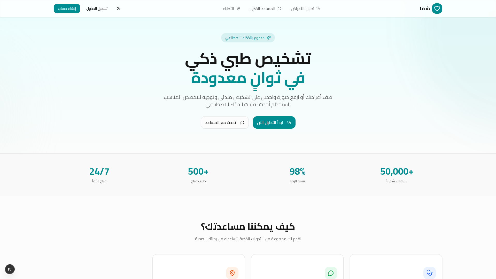

# 🏥 شفا - Shifa

<div align="center">



### منصة طبية ذكية للتشخيص المبدئي والإرشاد الصحي

[](https://nextjs.org/)
[](https://www.typescriptlang.org/)
[](https://tailwindcss.com/)
[](LICENSE)

[عرض المشروع](#) | [الوثائق](#-الوثائق) | [المساهمة](#-المساهمة)

</div>

---

## 📖 المحتويات

- [نبذة عن المشروع](#-نبذة-عن-المشروع)
- [المميزات](#-المميزات)
- [التقنيات المستخدمة](#-التقنيات-المستخدمة)
- [البدء السريع](#-البدء-السريع)
- [هيكل المشروع](#-هيكل-المشروع)
- [قاعدة البيانات](#-قاعدة-البيانات)
- [API Documentation](#-api-documentation)
- [التصميم](#-التصميم)
- [الأمان](#-الأمان)
- [المساهمة](#-المساهمة)
- [الترخيص](#-الترخيص)

---

## 🌟 نبذة عن المشروع

**شفا** هي منصة طبية ذكية باللغة العربية تهدف إلى مساعدة المستخدمين في الحصول على معلومات طبية موثوقة وتشخيص مبدئي للأعراض، مع توجيههم للطبيب المناسب. تجمع المنصة بين سهولة الاستخدام والدقة في المعلومات الطبية.

### لماذا شفا؟

- ✅ **واجهة عربية بالكامل** - تجربة مستخدم سلسة باللغة العربية
- ✅ **تشخيص ذكي** - تحليل شامل للأعراض مع توصيات دقيقة
- ✅ **مجاني بالكامل** - لا يتطلب أي اشتراك أو دفع
- ✅ **خصوصية تامة** - بياناتك محفوظة وآمنة
- ✅ **سهل الاستخدام** - تصميم بسيط ومتجاوب

---

## ✨ المميزات

### 1. 🔍 تحليل الأعراض الذكي

صفحة متكاملة لتحليل الأعراض تشمل:

| الميزة | الوصف |
|--------|-------|
| إدخال البيانات | العمر، الجنس، قائمة الأعراض، وصف إضافي |
| قائمة الأعراض المنظمة | مقسمة حسب الفئات (عامة، تنفسية، هضمية، إلخ) |
| نتائج شاملة | حالات محتملة مع نسب الاحتمالية |
| معلومات طبية | أسباب، عوامل خطر، طرق تشخيص |
| علاجات | أدوية شائعة + علاجات منزلية |
| توصيات | تغييرات نمط الحياة، علامات الخطر |

### 2. 💬 المساعد الطبي الذكي (شفا)

محادثة تفاعلية توفر:
- إجابات فورية على الأسئلة الطبية
- معلومات عن الأدوية واستخداماتها
- نصائح صحية وإرشادات
- توجيه للتخصص المناسب

### 3. 📍 البحث عن الأطباء

- تحديد الموقع الجغرافي تلقائياً
- فلاتر للتخصصات الطبية
- التكامل مع خرائط جوجل

### 4. 👤 الملف الشخصي

- إدارة المعلومات الشخصية والطبية
- رفع وتعديل صورة الملف الشخصي
- نظام النقاط والمستويات

### 5. 📜 سجل التشخيصات

- عرض تاريخ جميع التشخيصات
- تفاصيل كل تشخيص سابق
- إمكانية الحذف

### 6. 🔔 نظام الإشعارات

- إشعارات التشخيصات الجديدة
- إشعارات النقاط والمكافآت
- تذكيرات بالمراجعات

### 7. 🔐 نظام المصادقة الكامل

- تسجيل حساب جديد
- تسجيل الدخول/الخروج
- حماية المسارات

---

## 🛠️ التقنيات المستخدمة

### Frontend

| التقنية | الإصدار | الاستخدام |
|---------|---------|-----------|
| [Next.js](https://nextjs.org/) | 16.1.3 | إطار العمل الأساسي |
| [TypeScript](https://www.typescriptlang.org/) | 5.0 | لغة البرمجة |
| [Tailwind CSS](https://tailwindcss.com/) | 4.0 | التصميم والأنماط |
| [Shadcn/ui](https://ui.shadcn.com/) | - | مكتبة المكونات |
| [Framer Motion](https://www.framer.com/motion/) | - | الحركات والانتقالات |
| [Lucide Icons](https://lucide.dev/) | - | الأيقونات |

### Backend

| التقنية | الاستخدام |
|---------|-----------|
| [Next.js API Routes](https://nextjs.org/docs/api-routes/introduction) | الـ API |
| [Prisma ORM](https://www.prisma.io/) | قاعدة البيانات |
| [PostgreSQL](https://www.postgresql.org/) | قاعدة البيانات |
| [JWT](https://jwt.io/) | المصادقة |
| [bcrypt](https://github.com/kelektiv/node.bcrypt.js) | تشفير كلمات المرور |

---

## 🚀 البدء السريع

### المتطلبات الأساسية

- Node.js 18+
- npm أو yarn أو bun

### خطوات التثبيت

```bash
# استنساخ المشروع
git clone https://github.com/your-username/shifa.git

# الدخول للمجلد
cd shifa

# تثبيت المتطلبات
npm install

# إعداد متغيرات البيئة
cp .env.example .env
```

### إعداد قاعدة البيانات

```bash
# إنشاء قاعدة البيانات
npx prisma db push

# (اختياري) ملء البيانات التجريبية
npx prisma db seed
```

### تشغيل المشروع

```bash
# وضع التطوير
npm run dev

# بناء المشروع
npm run build

# تشغيل الإنتاج
npm start
```

### فتح المشروع

```
http://localhost:3000
```

---

## 📁 هيكل المشروع

```
shifa/
├── 📁 public/                    # الملفات الثابتة
│   ├── logo.svg
│   └── images/
├── 📁 src/
│   ├── 📁 app/                   # صفحات التطبيق
│   │   ├── 📁 (auth)/            # صفحات المصادقة
│   │   │   ├── 📁 login/
│   │   │   └── 📁 register/
│   │   ├── 📁 api/               # نقاط النهاية API
│   │   │   ├── 📁 auth/
│   │   │   │   ├── 📁 login/
│   │   │   │   ├── 📁 logout/
│   │   │   │   ├── 📁 me/
│   │   │   │   └── 📁 register/
│   │   │   ├── 📁 chat/
│   │   │   ├── 📁 favorites/
│   │   │   ├── 📁 notifications/
│   │   │   ├── 📁 profile/
│   │   │   ├── 📁 reviews/
│   │   │   ├── 📁 share/
│   │   │   ├── 📁 stats/
│   │   │   └── 📁 symptoms/
│   │   ├── 📁 chat/              # صفحة المحادثة
│   │   ├── 📁 doctors/           # صفحة الأطباء
│   │   ├── 📁 favorites/         # صفحة المفضلين
│   │   ├── 📁 history/           # صفحة السجل
│   │   ├── 📁 notifications/     # صفحة الإشعارات
│   │   ├── 📁 profile/           # صفحة الملف الشخصي
│   │   ├── 📁 reviews/           # صفحة التقييمات
│   │   ├── 📁 symptoms/          # صفحة تحليل الأعراض
│   │   ├── layout.tsx            # التخطيط الرئيسي
│   │   ├── page.tsx              # الصفحة الرئيسية
│   │   └── globals.css           # الأنماط العامة
│   ├── 📁 components/            # المكونات
│   │   ├── 📁 layout/
│   │   │   ├── header.tsx
│   │   │   └── footer.tsx
│   │   └── 📁 ui/                # مكونات UI
│   ├── 📁 lib/                   # المكتبات والأدوات
│   │   ├── ai.ts                 # وظائف الذكاء الاصطناعي
│   │   ├── db.ts                 # اتصال قاعدة البيانات
│   │   └── utils.ts              # أدوات مساعدة
│   └── 📁 styles/                # الأنماط
├── 📁 prisma/
│   └── schema.prisma             # هيكل قاعدة البيانات
├── .env                          # متغيرات البيئة
├── package.json
├── tailwind.config.ts
├── tsconfig.json
└── README.md
```

---

## 🗄️ قاعدة البيانات

### النماذج (Models)

```prisma
// المستخدم
model User {
  id          String   @id @default(cuid())
  name        String
  email       String   @unique
  password    String
  phone       String?
  birthDate   DateTime?
  gender      String?
  bloodType   String?
  image       String?
  points      Int      @default(0)
  level       Int      @default(1)
  createdAt   DateTime @default(now())
  updatedAt   DateTime @updatedAt
  
  diagnoses        Diagnosis[]
  favorites        FavoriteDoctor[]
  notifications    Notification[]
  reviews          Review[]
  sharedResults    SharedResult[]
  pointsHistory    PointsHistory[]
}

// التشخيص
model Diagnosis {
  id             String   @id @default(cuid())
  userId         String
  symptoms       String
  analysis       String
  recommendation String?
  specialty      String?
  severity       String?
  createdAt      DateTime @default(now())
  
  user           User     @relation(fields: [userId], references: [id])
}

// الإشعارات
model Notification {
  id        String   @id @default(cuid())
  userId    String
  type      String
  title     String
  message   String
  data      String?
  read      Boolean  @default(false)
  createdAt DateTime @default(now())
  
  user      User     @relation(fields: [userId], references: [id])
}

// الأطباء المفضلين
model FavoriteDoctor {
  id          String   @id @default(cuid())
  userId      String
  name        String
  specialty   String
  address     String?
  phone       String?
  lat         Float?
  lng         Float?
  createdAt   DateTime @default(now())
  
  user        User     @relation(fields: [userId], references: [id])
}

// التقييمات
model Review {
  id          String   @id @default(cuid())
  userId      String
  doctorName  String
  rating      Int
  comment     String?
  createdAt   DateTime @default(now())
  
  user        User     @relation(fields: [userId], references: [id])
}

// سجل النقاط
model PointsHistory {
  id          String   @id @default(cuid())
  userId      String
  points      Int
  reason      String
  description String?
  createdAt   DateTime @default(now())
  
  user        User     @relation(fields: [userId], references: [id])
}

// النتائج المشتركة
model SharedResult {
  id          String   @id @default(cuid())
  userId      String
  diagnosisId String?
  shareCode   String   @unique
  createdAt   DateTime @default(now())
  
  user        User     @relation(fields: [userId], references: [id])
}
```

---

## 🔌 API Documentation

### المصادقة

#### تسجيل حساب جديد
```http
POST /api/auth/register
Content-Type: application/json

{
  "name": "أحمد محمد",
  "email": "ahmed@example.com",
  "password": "password123",
  "phone": "01234567890"
}
```

#### تسجيل الدخول
```http
POST /api/auth/login
Content-Type: application/json

{
  "email": "ahmed@example.com",
  "password": "password123"
}
```

#### الحصول على بيانات المستخدم
```http
GET /api/auth/me
Cookie: auth-token=<jwt_token>
```

#### تسجيل الخروج
```http
POST /api/auth/logout
```

---

### تحليل الأعراض

#### تحليل الأعراض
```http
POST /api/symptoms
Content-Type: application/json

{
  "age": 25,
  "gender": "male",
  "symptoms": ["صداع", "حمى"],
  "description": "الألم شديد منذ يومين"
}
```

**الاستجابة:**
```json
{
  "possibleConditions": [
    {
      "name": "صداع التوتر",
      "probability": "40%",
      "description": "صداع شائع يسبب ضغطاً حول الرأس",
      "causes": ["التوتر", "قلة النوم"],
      "riskFactors": ["الإجهاد", "الجلوس الطويل"]
    }
  ],
  "recommendedSpecialty": "طبيب عام",
  "urgency": "منخفضة",
  "diagnosticMethods": [...],
  "treatments": {
    "medications": [...],
    "homeRemedies": [...],
    "lifestyleChanges": [...]
  },
  "recommendations": [...],
  "warningSigns": [...],
  "preventionTips": [...],
  "disclaimer": "هذا التشخيص للإرشاد فقط"
}
```

#### الحصول على سجل التشخيصات
```http
GET /api/symptoms
Cookie: auth-token=<jwt_token>
```

---

### المحادثة الطبية

```http
POST /api/chat
Content-Type: application/json

{
  "messages": [
    {
      "role": "user",
      "content": "ما هي أعراض الإنفلونزا؟"
    }
  ]
}
```

---

### الملف الشخصي

#### الحصول على البيانات
```http
GET /api/profile
Cookie: auth-token=<jwt_token>
```

#### تحديث البيانات
```http
PUT /api/profile
Content-Type: application/json
Cookie: auth-token=<jwt_token>

{
  "name": "أحمد محمد",
  "phone": "01234567890",
  "birthDate": "1995-01-15",
  "gender": "male",
  "bloodType": "A+"
}
```

#### رفع صورة الملف
```http
POST /api/profile/image
Content-Type: application/json
Cookie: auth-token=<jwt_token>

{
  "image": "data:image/jpeg;base64,<base64_image_data>"
}
```

---

### الإشعارات

```http
GET /api/notifications
Cookie: auth-token=<jwt_token>
```

---

### الإحصائيات

```http
GET /api/stats
Cookie: auth-token=<jwt_token>
```

**الاستجابة:**
```json
{
  "diagnosesCount": 15,
  "points": 150,
  "level": 3,
  "unreadNotifications": 3
}
```

---

## 🎨 التصميم

### نظام الألوان

```css
/* الألوان الأساسية */
--primary: #10b981;      /* الأخضر الرئيسي */
--secondary: #6366f1;    /* البنفسجي الثانوي */
--background: #ffffff;   /* الخلفية */
--foreground: #0f172a;   /* النص */

/* الوضع الداكن */
--background-dark: #0f172a;
--foreground-dark: #f8fafc;
```

### الخطوط

- **الخط العربي**: Cairo / IBM Plex Sans Arabic
- **الخط الإنجليزي**: Inter

### التجاوب

- تصميم Mobile-First
- نقاط التوقف:
  - `sm`: 640px
  - `md`: 768px
  - `lg`: 1024px
  - `xl`: 1280px

---

## 🔒 الأمان

### المصادقة

- **JWT Tokens**: صلاحية 30 يوم
- **HttpOnly Cookies**: حماية من XSS
- **bcrypt**: تشفير كلمات المرور

### حماية البيانات

- التحقق من المدخلات باستخدام Zod
- حماية CSRF
- تنظيف البيانات قبل التخزين

---

## 🧪 الاختبارات

```bash
# تشغيل الاختبارات
npm test

# اختبارات E2E
npm run test:e2e
```

---

## 🤝 المساهمة

نرحب بمساهماتكم! يرجى اتباع الخطوات التالية:

1. **Fork** المشروع
2. إنشاء فرع جديد (`git checkout -b feature/AmazingFeature`)
3. **Commit** التغييرات (`git commit -m 'Add some AmazingFeature'`)
4. **Push** للفرع (`git push origin feature/AmazingFeature`)
5. فتح **Pull Request**

### قواعد المساهمة

- اتبع معايير الكود الموجودة
- أضف اختبارات للميزات الجديدة
- حدّث الوثائق عند الضرورة
- تأكد من عمل `npm run build` بنجاح

---

## 📄 الترخيص

هذا المشروع مرخص تحت رخصة MIT - راجع ملف [LICENSE](LICENSE) للتفاصيل.

---

<div align="center">

**صُنع بـ ❤️ في مصر**

[⬆ العودة للأعلى](#-شفا---shifa)

</div>
